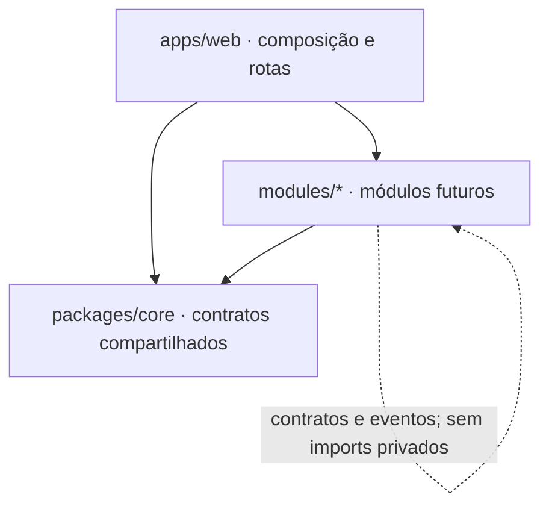

# Arquitetura inicial

## Estado da versão 0.1.0

Monorepo npm com `apps/web` (Next.js App Router, TypeScript, CSS Modules) e `packages/core` (tipos e contratos públicos). `modules/` descreve domínios futuros. A única interação de estado é a prévia visual de dois workspaces; ela não representa autenticação nem isolamento de dados. A escolha de tema é a única preferência gravada no navegador.

## Fronteiras



- O Core define identidade, workspace, autorização, arquivos, busca, tema e integrações compartilhadas conforme forem necessárias. Não contém regras financeiras, de clientes ou de diário.
- Cada módulo é proprietário do seu modelo e interface públicos. Sua documentação especifica comandos, consultas, eventos e regras de permissão. A pasta de outro módulo não é uma API.
- A camada web monta os módulos, fornece navegação e aplica temas. CSS Modules impede seletores locais de alcançarem telas alheias; `globals.css` contém apenas reset e tokens.
- Integrações externas usam adaptadores e timeout/erro explícitos. Nenhum serviço externo é pré-requisito para abrir a tela atual.

## Modelo de identidade previsto (a implementar)

```text
user(id)
workspace(id, name, kind, created_by)
membership(user_id, workspace_id, role)
module_record(id, workspace_id, ...)
```

Todo acesso a `module_record` deverá conferir a associação do usuário ao workspace e permissões específicas da ação **no servidor e no banco**. O ID recebido do cliente não é autorização. Relações entre workspaces são operações explícitas, com origem, destino e auditoria. Papel `owner` não elimina checagens de escopo. Nenhuma tabela acima existe na versão 0.1.0.

## Stack e armazenamento previstos

Next.js + TypeScript formam a aplicação; PostgreSQL é o banco proposto, com migrations versionadas e política de acesso por workspace. O provedor de autenticação e a forma de hospedagem serão decididos e documentados antes da primeira conta real. IndexedDB/PWA ficam para uma fase com estratégia de sincronização e conflitos; armazenamento local não deve ser tratado como cópia confiável de dados sensíveis sem essa análise. O tema usa apenas `localStorage`.

## Segurança, backup e operação

Na fase com dados reais: sessão validada no servidor, princípio do menor privilégio, RLS ou proteção equivalente no banco, testes de isolamento de workspace, tokens de integração no servidor, URLs temporárias para arquivos privados, log de ações sensíveis, exportação e procedimento testado de restauração. PRs devem avaliar migrações e compatibilidade antes de serem integrados.
