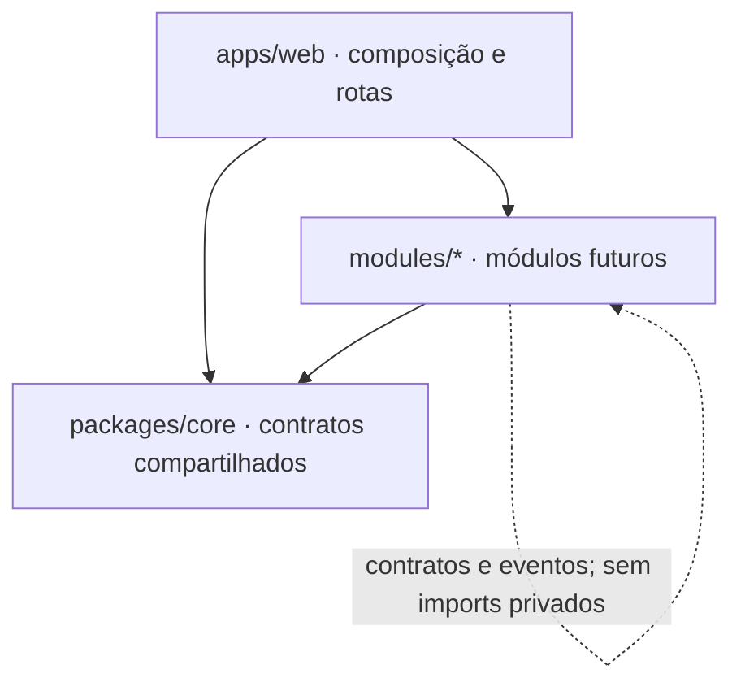

# Arquitetura inicial

## Estado da versão 0.3.0

Monorepo npm com `apps/web` (Next.js App Router, TypeScript, CSS Modules) e `packages/core` (tipos e contratos públicos). `modules/` descreve domínios futuros. O login por link usa Supabase Auth e cookies SSR. Workspaces e Core estão em `/app`; a seleção na página pública ainda é uma prévia visual. Sem configuração Supabase, a página pública permanece disponível e o login explica como ativar a aplicação.

## Fronteiras



- O Core define identidade, workspace, autorização, arquivos, busca, tema e integrações compartilhadas conforme forem necessárias. Não contém regras financeiras, de clientes ou de diário.
- Cada módulo é proprietário do seu modelo e interface públicos. Sua documentação especifica comandos, consultas, eventos e regras de permissão. A pasta de outro módulo não é uma API.
- A camada web monta os módulos, fornece navegação e aplica temas. CSS Modules impede seletores locais de alcançarem telas alheias; `globals.css` contém apenas reset e tokens.
- Integrações externas usam adaptadores e timeout/erro explícitos. Nenhum serviço externo é pré-requisito para abrir a tela atual.

## Modelo de identidade implementado na migração

```text
auth.users(id)
public.workspaces(id, name, kind, created_by, created_at)
public.workspace_members(user_id, workspace_id, role, joined_at)
public.core_files(id, workspace_id, uploaded_by, object_path, ...)
public.core_tags(id, workspace_id, name)
public.core_file_tags(workspace_id, file_id, tag_id)
public.core_notifications(id, workspace_id, recipient_id, ...)
public.core_audit_events(id, workspace_id, actor_id, action, ...)
storage.objects(bucket_id='workspace-files', name='<workspace-id>/<file-id>/<name>')
module_record(id, workspace_id, ...) — previsto
```

`workspaces` e `workspace_members` têm RLS e apenas SELECT para usuários autenticados. A política de membros mostra ao usuário somente sua associação; a política de workspaces só mostra IDs associados. `create_workspace` cria workspace e associação `owner` na mesma transação. INSERT/UPDATE/DELETE diretos não são concedidos. O ID recebido na URL não é autorização: a página verifica claims e o banco filtra a consulta. O Core usa RLS nas suas tabelas e no bucket privado, vínculo composto para impedir tags de outro workspace, busca com direitos do invocador e auditoria da exportação. Registros de módulos futuros deverão incluir `workspace_id` e políticas próprias. Transferência, compartilhamento e edição ainda não existem.

## Stack e armazenamento previstos

Next.js + TypeScript formam a aplicação; PostgreSQL via Supabase armazena usuários, workspaces, associações e metadados do Core. O Storage guarda bytes em bucket privado. O código usa a chave publicável, sessão por cookie e RLS. Não há chave `service_role`. IndexedDB/PWA ficam para uma fase com estratégia de sincronização e conflitos. O tema usa apenas `localStorage`.

## Segurança, backup e operação

A página `/app` e cada detalhe verificam claims e fazem consultas sob RLS. O Proxy renova a sessão por requisição; rotas autenticadas são dinâmicas e downloads/exportação têm `Cache-Control: private, no-store`. Os testes PostgreSQL simulam usuários distintos, tentativas de escrita indevida e acesso anônimo. Antes de usar contas reais, aplicar migrações no ambiente Supabase de teste, verificar e-mail, Storage, duas contas e a restauração de banco e bytes. Veja [ADR-005](decisions/ADR-005-core-files.md) e [operação do Core](CORE.md).
